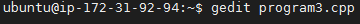
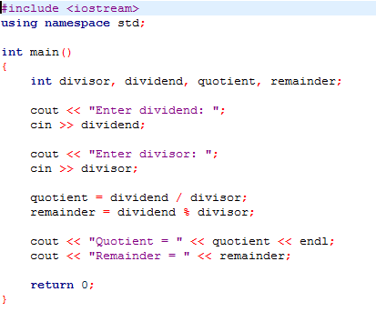
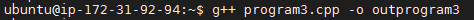
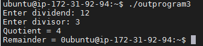

# Program 3: Division of two numbers

## How to execute C++ program on lenux(Ubuntu).

### Step 1:

Open the terminal and check the version,

    Command : gcc -v

If the message comes, _command not found_, then type the update command,

    command : sudo apt install gcc

    then,

    command : sudo apt install gedit

    then,
    
    command : sudo apt install g++

(* The upper three commands should be executed only when the message comes, _command not found_)

Again, check the version,

    Command : gcc -v

If the version appears then type,

This will **create** the cpp file name as program1.cpp. Here a textpad will apper where we have to write the C++ program,

***
## Step 2:

Give the command,

After the command if there is any error in the program, it will appear, if not nothing will appear in next line. Here _program3.cpp_ is the cpp file we created and _outprogram3_ is the _output_ file.
***
## Step 3:

Now,

Using ./outprogram3 we will gwt the output in next line, that is **values of quotient and remainder** in this program.
***
***