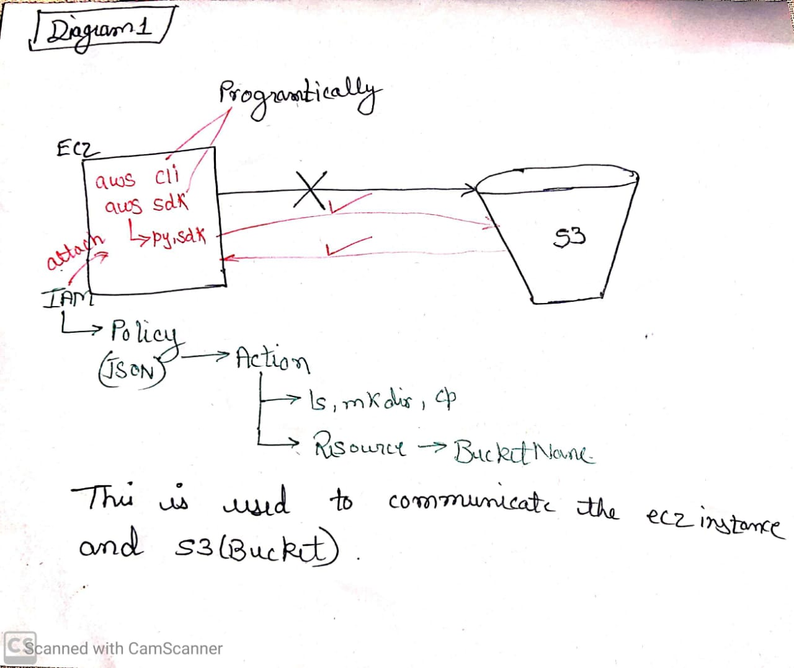
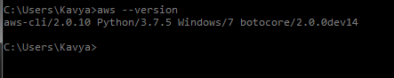
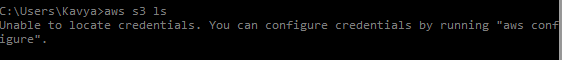
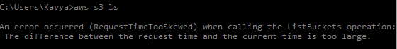
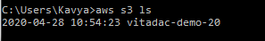

# Day 5

## Accsess s3 using aws cli

As we know, s3 (Bucket and ec2 cannot communicate directly with each other, as they need authentication/access to do that. S0, we attach IAM Role in ec2 and created policy inside it (which is in json format), to make the communication possible.

* Now, we have to use s3 through our Local terminal in (laptop) system. So we have to install AWS cli from  official site. 

* After downloading and installing AWS cli, open the terminal (cmd) and check the version using command,

_If the command executes then AWS cli sdk is properly installed in the system._

* Now, use the command,

        aws s3 ls

_Here, we get the error as shown in the screenshot. It says, unable to locate configuration, as the details are not attached to it yet._

* Now, we have to go to classroom tab and click on account details. Now, click on **Show Here**, here we see all the detail our aws cli.

* Now, go back to local terminal and execute the command,
  
        aws configure

* Now it ask for Access key ID:
  
  Copy the Id from account details on classroom tab and paste it in local terminal and then press enter. 
  
* Now, it ask for Access key:

    Copy the Key from account details on classroom tab and paste it in local terminal and then press enter.

* Now, it ask for Default reagion name:

    Check the name in ec2 account in topmost right corner, last second option, in dropdown first line. Copy the name and paste it in local terminal and press enter.

* Now, it ask for Default output format:
    
    As we know, default format is _Json_, so type _json_ and press enter.
    
_This process of inserting the details of cli is only one time process._

* Now, again give the command
  
        asw s3 ls

    If we are getting invalid error then, we have done something wrong while copy pasting details and have to do a same process again by giving command,

        aws configure

    If not then, we will get this error ,as shown in screenshot below,

    

* So, now we have to make some adjustments in _.aws file_ (in windows), follow the path,
  
        My computer -> c drive -> user
        
        -> Administrator_name -> .aws -> credential

* Now, open _credential_ file using notepad and delete everyything inside it.

* Now, go to aws console and copy all the details of aws cli and paste it in _credential file_ and save it. 
  
* Now, go back to the terminal give the command
  
        asw s3 ls

    Here it will work successfully, as shown in screenshot,

_This means we can now access s3 with local terminal using aws cli._

***

## Why do we do not use IAM role outside aws or aws cli ?

IAM Role can be accessible only inside AWS, they are not permitted inside aws cli

If we have to access the the account using cli, we have only one option i.e., access id & access key. Although we can use access id and access key inside aws as well.

***

## ec2 vs. RDS

### As we know, we have ec2 and RDS, so we can install database in ec2 as well ! So, what will be a better option, to use ec2 or to use database ?

* EC2 is managed by aws  but if we install any application within ec2, then that application have to be manage by user not AWS. Lets say, My SQL is installed by user and if it gets currupt or issue of low speed occurs, it will not be manageable by AWS, it will be the AWS's but user or developer's responsibility to handle it.

* On the other side, if we use RDS for My SQl, we only have to pay for My SQL server and we will never get any issue of maintainance or low speed as it is manageable  be AWS.

* In case of ec2, scalability also have to be maintain by the user whereas in case of RDS, its AWS's responsibility here as well.

***

## S3

The topmost layer inside s3 is 'Bucket'. Inside bucket, everything is aan object. As we know, objects are immutable, i.e., we cannot change/update them, we have to delete them and recteate.

We have one other option as well where if we already have a file and we have to update it then, create a new file with same name and then upload it, so that the old file will get overwritten by this new file.

***

## LAMBDA

LAMBDA is base on serverless concept, which means we don't own a server, have zero maintainance and scalability.

###  Runtime costing:

Here lets take an example, we have a ec2 server having 4 Gb RAM, 8 Gb volume and 2 core processors. To use it, we have to create it and keep it even we don't use it all thye time. Even we have 8 Gb bolume and 4 Gb RAM, it will never be 100% utilise in any operation, Nevert ! But, still we have to keep it and pay for it.

But in LAMBDA, we have LAMBDA function where we do not get any server i.e., we don't own anything.
Using this function  if we create any de using any language, we can store it using lambda free of cost. We do not have any limit on number of codes to be saved here i.e., we can save unliited codes without paying a single Peny ! The charge will be applied, only when we run the code and only for the time for which that code takes to run. The menory, OS and RAM that takes to run the code is free in lambda.

###  Scalability and parallelization :

In lambda the scalability i.e., the RAM and volume will get automatically increase as per the requirment of code and will be charged per that. So no wastage of memory and RAM here and less costing.

Now, in parallelization, what lambdaa does is, it automatically executes the request or codes,the number of times requested, here their is no need of any threading for this. We do not have to set or provide any command for this.
***
***