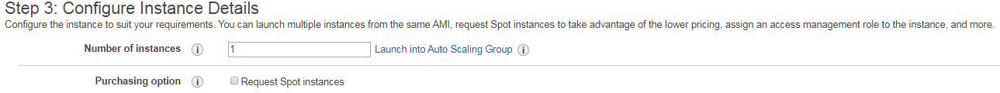
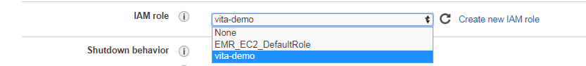
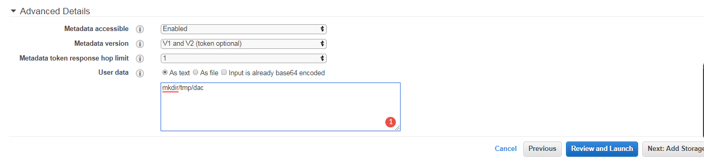
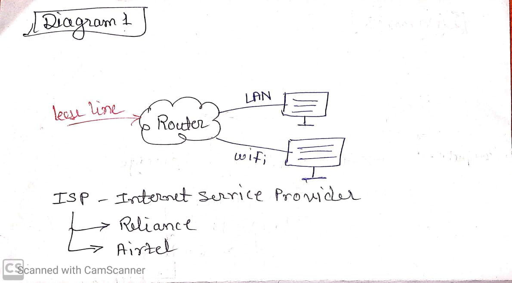
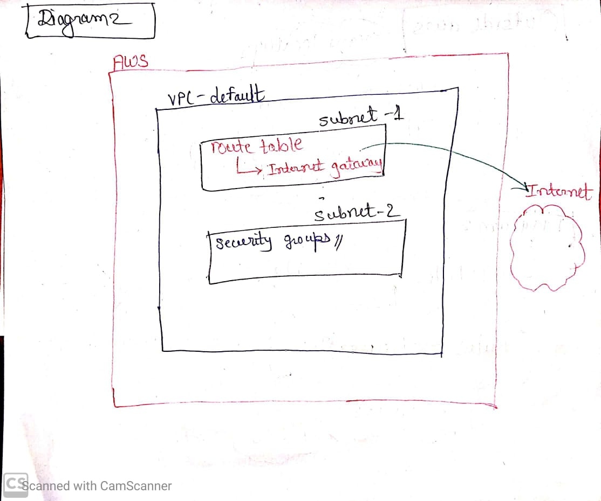
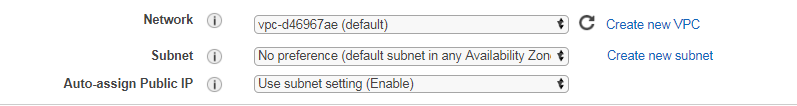
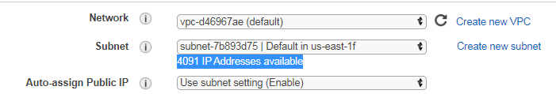

# Day 6

We have goan through some of the services till now. So today we are going to create one instance and try something new in it. At fitst when we created some instance, we have neglected some of the default settings  we were nuw in AWS cloud. But now we are able to get it, so today we are gonna discuss about  those things.

When we were on **configure page**, we kept it _by default_ and went to next page, Today, try discuss about _some of the features on this page_.

### Number of instances:

It is use to create multiple instances at one time. We just have to put the number of instance.

### IAM Role:

Here, we can select already created IAM Role and can attach it to instance, at the time of creating it or after creating it.

### Shutdown behaviour:

This is to select that, in which state the instance will go after shuting it down either, stop or terminate. Usually, it is preffered stop.

### Stop - Hybernate behaviour:

It is use to enable hybernate behaviour like we have seen in _Windows_.

### Enable termination program:

Check the box with _'Right Symbol'_ which will **Enable hybernation as additional stop behaviour**.

Now, lets see advance details,

###  User data:

_Keep all the selection as it is and lets go to **user data** in **Advance Details**_,

There are two options in user data,

* As text
* As file

Use *as text*, by using as text if e have to create server or directory inside the ec-2, we can create it, by passing command/s. In this case, we are creating *Linux*  instance and create the directory by passing command,

    mkdir/tmp/dac

as shown in screenshot.

In user data, whenever we give command using *LINUX*/*Windows*/Any other OS, those commands will execute as **Root user**.

In user data, we can also pass any script with commands such as in *Linux*, we can share Shellscript, in *Windoes* PS script. 

While using command which need feedbach, we have to give that command wuth **feedback command**,

    Ex.:yum update -y

       where, -y is 'yes'

[Note : In the path, we have to use _**instances**_ carefully rather than _instance_ and Id will be different according toour instance.]

**User data** is used when we have to create an instance and after that we have to install any application in that instance. Using _user data_, we can install the application and create the instance at same time, by giving the command/s in user data. 

### Network :

Now, on *configure page*, there is a part called **Network** which is known as VPC (Virtual Private cloud), lets figure out what it is.

As we know, we own the internet , it is a comman platform through which we all are connecting by using various devices.

Lets take the example of internet service we use at our home, using CV,

Using router, we can manage the access of internet at specific level i.e., blocking site, etc. But in cases like home service or in company, IPS hides some features like VPC, which is at organisation level i.e. company level which is usually one (can be created multiple as well).

In *VPC* they **configured the internet** i.e., they give permission to various sites, create the firewall, etc. There are some VPS's where they do not allow internet such as banking.

To create VPC, on emust have enough knowledge of networking. If someone have basic knowledge, that person can create basic VPC._(In AWS, do not make any change in default VPC)_.

Lets have an overlook to *Network* using CV,

***

## Monitoring

As we do not get any physical entity of  laptop using AWS, they provide us monitoring. However, we can check what are we paying for such as CPU usage, RAM usage (in the form of graph).

Whereas, on the right top side, we can check graph w.r.t. time as well.

So, it is use to moniter working of employees and to change the congiguration such as CPU, increase in RAM etc by monitering the graphs.

There are two concepts in monitering:
* Cloud Watch
* Cloud trial

### Cloud watch:

Basically, it moniters resources and web applications. This means , if we are getting any error while using AWS, CPU usage, RAM usage then it will be recorded in cloud watch.

### Cloud trial:

Whenever we perform any actionon AWS UI, it gets stored in cloud trial. Basically, it tracks user activity and API usage.
***

## Lambda

Lambda is use for,

    1. Event driven automation
    2. To covvert Lambda as API

Here, in _Event driven automation_, we can configure the event in S3 service service i.e., whenever we add the file in S3, it trigger the lambda function automatically.
***
***

