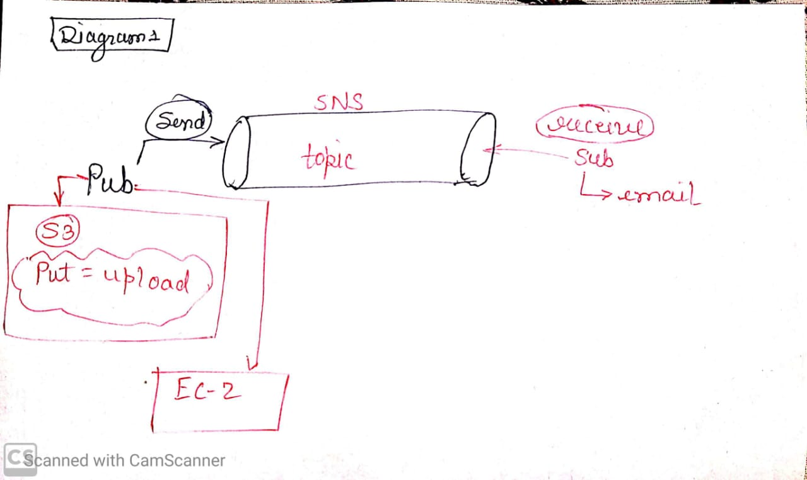

# Day 7

**Q. If theree is no server in AWS serverless computing, then where the data gets stored?**

_Ans._ In serverless computing code runs in the backend, only for the time period only for the time period it takes to execute. and then destroyed it, Serverless executes application logic without storing data.
***
## SNS (Simple Notification Service)

This service is use to send the notification using various means such as messag, email, etc.

For ex., whenever we create ec-2 or whenever the server is down in ec-2. We should get notification using _SNS_. There are two main things in SNS to look for,

* Topic

* Subscription

* **Topic** - Topic is use to give the topic name where the notification should be send and saved. In topic, display name is use to display the nameof notification sender.

* **Subscription** - The SNS works on _pub and sub model_ which means "Publisher and subscriber". This means someone have to send the message and someone have to receive it.
***

## Alarm

Using _alarm_, we can set the notification trigger (with the help of SNS), at a specific situation. This situation can be related to any service.

For ex., we can create an alarm which will send the notification using email whenever the status check of ec-2 will take more than one minute for two consecutive actions.
***
## Volume (snapshot)
Volume is a storage space (harddisc) in ec-2 as we know. If the instance get deleted, the volume and data in which in it also get deleted, which is critical for the user.

To overcome this critical condition, we can create _Snapshot_ in volume which is a copy at a perticular time in ec-2.

If we recreate the snapshot again, it will be inincremented order which means if we create first snapshot and the we add some filein thet snapshot afterwords, then it will add onlynewly added file or data in second snapshot.
***

## Image

we can create, _image_ of ec-2 instanceby setting the volume and other aspects. Just like in volume, we create copy by making a snapshot, here we create copy of AMI (OS) using _image_ and then we can use this image (including volume) while creating other instances.
***

## Lambda (Third party lib.)

When we were writing code in lambda function using nodeJS or JAVA, the code gets executed. But there is a possibility that, we can use some other third party libs.in JAVA as well.

Whenever we use any third party lib. in _lambda_ which means those libraries which are not default part of any software or application, we have to create bundle _then built jar using mavin_ and then have to upload it. But there is a possibility that, er can use some other third party lib in JAVA as well.
***
## S3 Features

Even if S3 is a storag, still we cannot compare it with google drive because we can perform a lot more using S3 service in AWS. As, we have already seen we can configure events in S3 as well as we can host the pages of static website in S3. There are some more features in S3 as discussed below,

* We can prieve and run small querieson data in S3 on CSV, parquet and Json format only (only in table format file).

* We can **_enable version_** in S3 means for critical data we update data time to time. But, sometimes we need data from the file before update was done. By enableing the version, we can access that file as well. It's like accessing the file from the past! So, we say that, S3 mentain the version.

* Using _logging_, we can see that who and when had access the data from the 'Bucket'. Using **Server access logging**, those whose requests are accepted can access the _bucket_, where as in **Object-level logging**, the object anc be access by the requester. Bacically,_get or push_ (high level) functions are recorded in **Server access logging** and *SNS or Events* are recorded in **Object-level logging**.

* The most important feature in S3 is default encription. As most of the peaple add their data on cloud, but what is the *gurentee* that AWS is not accessing our data ?
So, AWS provide us with encription as if someone try to access the data in data center, it is not possible as it is by default encripted. But if still someone have trust issues, then by applying **default encripting feature**, we can make the data more secure.

* If we are saving some important file in S3 which we do not want to delete even accedently, then create a new _bucket_ and then place the file in it by enableing **_Object Lock_**.

* ***Requester pay*** is the feature in which we can request AWS to send the bill to that someone who is using the data by creating different bucketys for different user.

*Some of the features are paid and some of these are free of cost*.
***
*** 