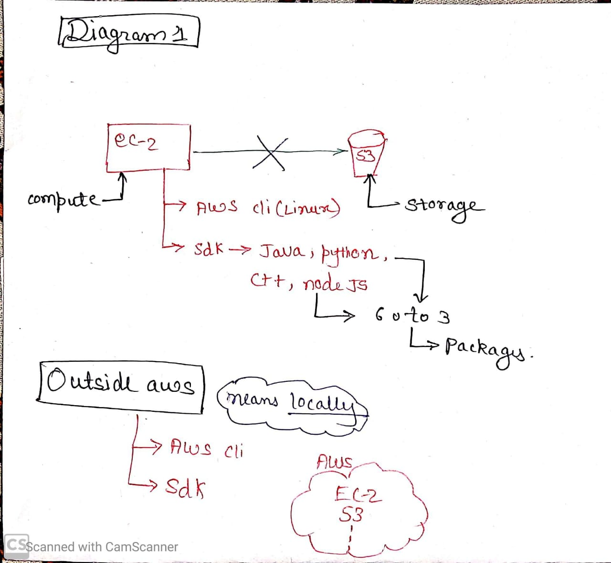
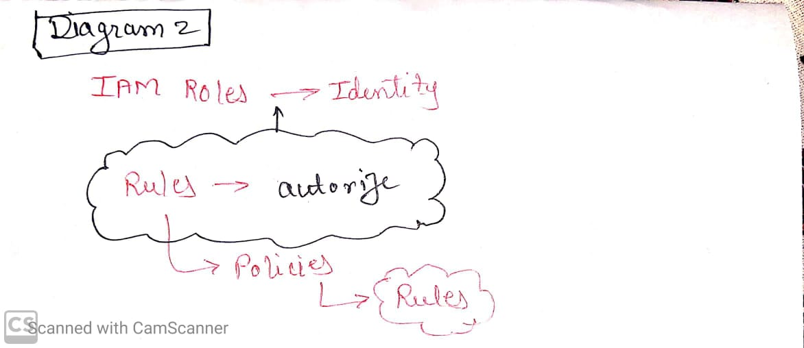
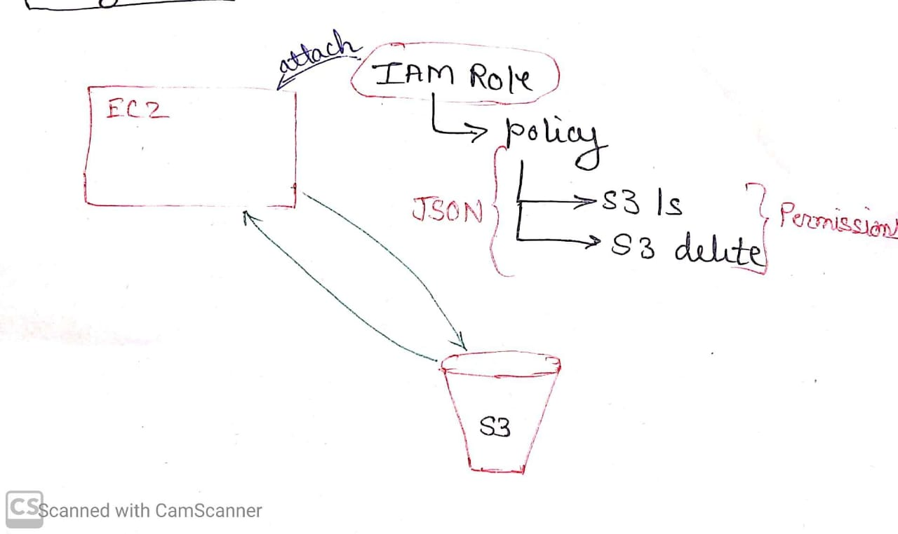
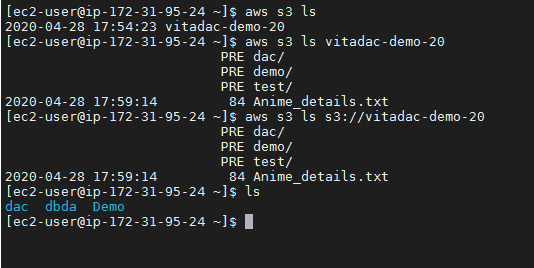
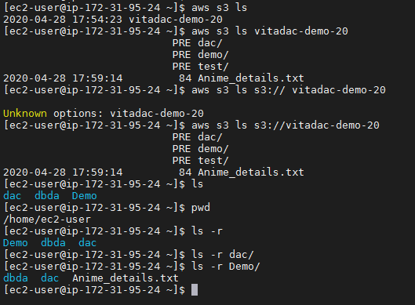
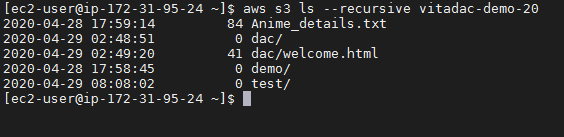
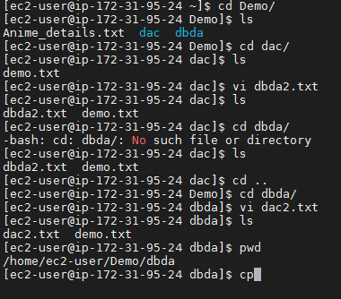

# Day 4

Till now we have studied ec2 and S3 (Bucket). Here, in S3 we can store data. Here, in S3 we can store data & using ec2 we can compute. Using ec2 we cannot communicate in AWS  with S3. S0,we are going to study about it now.

We can use AWS cli (Linux) & Sdk (java, python, C++, node JS).

We can communicate outside AWS as well, which means locally. Also, we can communicate  using AWS cli and sdk.AWS Cli works like,core principle (LINUX).

    AWS<service_name> -[Command option]

    eg.:aws s3 ls
    
    This is unable to resolve as it cannot communicate, as path is not given.

## Service: IAM Roles

It is simply an identity.

 What we have to do here is showb in CV,

 

We have to create IAM Role (Identity Access Management) which free of cost & unlimited.This IAM Role is attach to policies which are nothing but different permissions for command and access which is similar to JSON which is a kind of dictionary. (After creating (policy)role).

### AWS CLI:

    aws s3 ls --recursive <bucket_name>

***

### AMI:

    Name         | Username      |
    -----------------------------|
    Ubuntu       | ubuntu        |
    Centos       | centos        |
    Amazon linux | ec2-user      |
    windows      | Administrator |

***

### Linux Cammand:
 * Copy command - (to copy)
    
        cp source destnation

    If we create a folder on some other destination and we have to copy it back to its write place.

By using this, we have to copy first and then delete the old file, as it is just coping it and keeping its copy on destination. To avoid this, use move command. 

* Move command - (to move)
  
        mv source destination

* Delete command - (to remove)

        rm <file_path>
 
* ls -a command - (to show hidden files)

* ls -l command - (Specify all files in details)

* history command 
  
   It record all the       command, we have used till their and show them.

* Command - 

        ctrl+R - search for alphabet we type.

Eg.: mk
This shows command starts from mk i.e., mkdir to go in reverse searching, press ctrl+R again and again.

Press _left or right arrow key_ to get out from this command.
***
***

